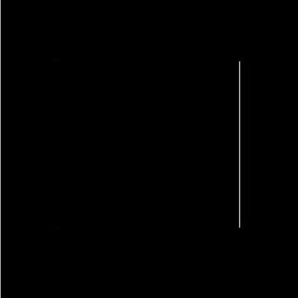

# Image Gradient Concept and Application

In this post, we are going to explain what it really means to find the derivative of an image, the method to calculate the image gradient ,and how to use it for edge detection using python. 
 
 

## Image Gradient 
The derivative of a function measures the rate of change of the function with respect to its independent variable. It is also referred to like the slop of the function. Functions can be continuous or discrete. A digital image is an example of 2D discrete functions. 

### One Dimentional Funtions
A 1D image can be seen as a row of some pixels, such as the following: 
 
 

These discrete values represent the color intensity and the derivative of the entire row represents the intensity change as we move from one pixel to another. 

Among the methods that are used to approximate the first derivative of a discrete function, the central finite difference gives the best results:
 

This is also the same as applying a 1D filter on the image, which is known as convolution. 

Applying the above method on our 1D digital image yields:
 

 

### Two Dimentional Functions

For multivariable functions, partial derivative measures the rate of change with respect to each of the independent variables. It is also referred to as the gradient of the function. The gradient of a 2D image  is formed by combining the partial derivatives of the image in the  direction and  directions as:
 
 

 

 measures the rate of change of pixel intensity in the  direction and it is approximated as:

 
 

 

and  measures the rate of change of pixel intensity in the  direction and it is approximated as:

 
 

Similar to our example of the 1D image, the partial derivatives can be calculated by convolving the image with   and   filters  individually. By using the central finite difference method, the   and   filters are:
 

## Properties of the Image Gradient
When convolving a grayscale image with the   and  filters, we get two output feature images. One describes the rate of intensity change horizontally and the other describes the rate of change vertically.
 

For each corresponding pixel position of those feature images, we can calculate the gradient magnitude and its direction.
 
 
         

 
The magnitude is the amount of intensity change at a given pixel. The higher the value, the higher the change. As we shall see in the implementation section in this post, the magnitude is used to detect edges in the image. 
 
 

 

The direction of the gradient tells us the direction of the intensity change at a given pixel. 

## Implementation of Image Gradient for Edge Detection
In this section, we are going to make use of image gradient in edge detection, which is one of the fundamental tools in image processing and computer vision. 
 
 
Technically, an edge is a border or the frame of an object. In terms of colors, an edge is a region (line or point) where the color changes. Mathematically, an edge is the change of numbers when moving from one pixel to another; in other words, it is the gradient of the image. 
 
 
The result of convolving the image with the   and  filters is two feature images with only black and white colors. The white color indicates the edges. The rest is just black. 

The partial derivative of the image with respect to the  axis (or the rows) detects the vertical edges. This is also the same as convolving the image with the  filter. The horizontal edges are detected by convolving the image with the  filter. 
 
 
In order to combine both feature images (the vertical and the horizontal edges), the magnitude is used. Higher magnitudes indicate the presence of edges. For images with simple shapes such as only a square, it suffices to use the magnitude with no further editing to find the edges. However, in more complex images, the wide range of pixel intensity results in a wide range of magnitude. As a result, the output looks messy. In this case, we pick up values of the magnitude above a certain threshold. 
 
 
In summary, the pseudu algorithm to find the edges is:

* Convert the image into grayscal
* Convolve the image with the  filter
* Convolve the image with the  filter
* Compute the magnitude
* Apply a threshold on the magnitude
 
 

The following images visualize those steps respectively:
 
 
<kbd>
   
</kbd>
<kbd>
  
</kbd>
 
 

 
Please note that the above algorithm and the code are fundamental. The purpose of them is mainly to explain the concept of the image gradient. This algorithm was further developed. The famous edge detection techniques out there are Sobel and Canny edge detections. Each has its pros and cons. We will look at them in the next post.

 
 
 
Resources:
 
Digital image processing Book
 
Wikipedia

